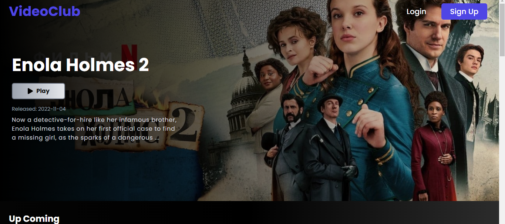

# VideoClub App

Movies app with a Netflix vibes. For the data requests i used The Movie Database Api. I Built the entire app with React.js, JavaScript, TailwindCSS, Firebase and React-router-dom. You can sign up and sign in with Firebase Auth and I used firestore to save movies into a firestore database.

## Link

Deploy Site: [https://video-club-app.vercel.app/](https://video-club-app.vercel.app/)

## Screenshots




---

## API

For the data requests i used

- [https://www.themoviedb.org/documentation/api](https://www.themoviedb.org/documentation/api)

## Built with

- React
- Javascript
- Tailwind
- Firebase Auth
- Firestore db
- react-router-dom-v6
- react icons
- react toastify
- React Hooks

## How to use

> Before you can run this app, you need to get an API KEY from The Movie Database, please go to [The Movie Database](https://www.themoviedb.org/documentation/api)

> Also you need to create a new project in your firebase account and get your personal firebase api keys. Please go to [Firebase](https://firebase.google.com/)

1. Clone this repo

   ```bash
       git clone https://github.com/matiarias/video-club-app
   ```

2. Install all the required dependencies.

   ```bash
       npm install
   ```

3. To start on your local machine:

   ```bash
       npm run dev
   ```
